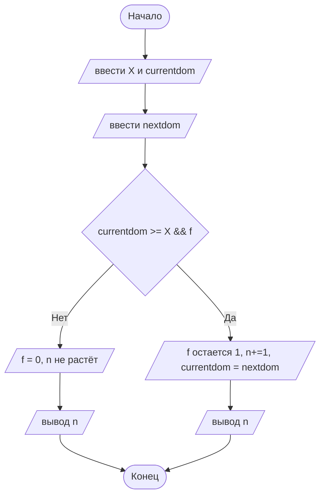

## Отчет по лабораторной работе № 1

#### № группы: ПМ - 2601

#### Выполнил: Мишин Михаил Борисович

#### Вариант: 15

###  Содержание: 

- [Постановка задачи](#1-постановка-задачи)
- [Входные и выходные данные](#2-входные-и-выходные-данные)
- [Выбор структуры данных](#3-выбор-структуры-данных)
- [Алгоритм](#4-алгоритм)
- [Программа](#5-программа)
- [Анализ правильности решения](#6-анализ-правильности-решения)

### 1. Постановка задачи

> На вход подается 6 натуральных чисел: расстояние между соседними домино и длина каждой соответственно. Необходимо подсчитать, сколько домино упадет.

Для решения данной задачи нужно сравнивать длины домино и расстояние X. Падение произойдет, если длина домино >= x, если длина < x, то следующее домино остается стоять.

### 2. Входные и выходные данные 

#### Данные на вход 

На вход программа получает 6 натуральных чисел. X - расстояние между домино, далее вводятся значения длин домино. Max значение будет ограничено лишь типом данных.

|         | Тип                                | min значение | max значение   |
|---------|------------------------------------|--------------|----------------|
|    X    | Целое положительное                | 1            | не ограничено  |
|    A    | Целое положительное                | 1            | не ограничено  |
|    B    | Целое положительное                | 1            | не ограничено  |
|    C    | Целое положительное                | 1            | не ограничено  |
|    D    | Целое положительное                | 1            | не ограничено  |
|    E    | Целое положительное                | 1            | не ограничено  |

#### Данные на выход 

Количество упавших домино, 1 натуральное число, обозначим за n. n max = 5, т.к. максимальное число упавших домино = 5.

|         | Тип                                | min значение | max значение   |
|---------|------------------------------------|--------------|----------------|
| n       | Целое положительное                | 1            | 5              |

### 3. Выбор структуры данных 

Программа получает 6 натуральных чисел. У нас нет какого-либо ограничения, кроме понятия натурального числа (min = 1, max не существует), поэтому для их хранения можно выделить 3 переменных (X - расстояние между домино, currentdom - "текущее" домино, nextdom - следующая домино) типа int. Для переменной-счётчика n также выбираем int. Для флаговой переменной f соответственно выбираем логический тип данных boolean. 

### 4. Алгоритм 

#### Алгоритм выполнения программы: 

  1. **Ввод начальных значений**
     
     Первоначально вводим целое положительное значение расстояния между домино,
     обозначаемое int X. Далее вводим значение длины первой домино (в цикле далее будут введены оставшиеся 4 значения).

  3. **Переменные**
     
     Задаем переменные: boolean f = true (флаговая переменная, с помощью нее можно точно определить, для всех ли предыдущих значений домино выполнилось       условие, int n = 1 (счётчик упавших домино, равен 1 изначально т.к первая домино упадёт в любом случае)
    
  4. **Основная суть программы**
     
     Цикл for: аргумент цикла = 0, увеличивается до 3 включительно (то есть цикл сработает 4 раза, чтобы ввести 4 оставшихся числа). Внутри цикла вводим      значение следующей (еще не упавшей доминошки). Внутри цикла if, если длина текущей домино >= X и f == true (просто пишем f), то в таком случае           n+=1 и значение текущей домино заменяем на значение следующее и так далее. Если хотя бы одно условие не выполнилось, то f = 0 и n невозможно             увеличить, при этом значения длин доминошек мы можем ввести.
     
  6. **Вывод результатов**
     
     Выводим n с помощью println.

#### Блок-схема




### 5. Программа 

```java
//подключаем библиотеки для ввода и вывода данных с клавиатуры
import java.io.PrintStream;
import java.util.Scanner;

public class Main {
    public static void main(String[] args) {

        //объявляем объект класса Scanner для ввода данных
        Scanner in = new Scanner(System.in);
        //объявляем объект класса PrintStream для вывода данных
        PrintStream out = System.out;

        //вводим с клавиатуры значение X - расстояние между домино
        int X = in.nextInt();

        //длина первой домино("текущей")
        int currentdom = in.nextInt();

        //задаем флаговую переменную f логическим типом данных boolean
        //если условие хоть один раз нарушится (f = false), то перестаем увеличивать n
        boolean f = true;

        //n - счётчик упавших домино, изначально = 1,
        // т.к первая домино в любом случае падает
        int n = 1;

        //задаем цикл от 0 до 4, чтобы 4 раз ввести переменные, т.к длину первой домино ввели уже до этого
        //на 1 шаге i = 0 и так далее до 3 включительно, то есть всего 4 повторения
        for (int i = 0; i<4; i+=1){
            int nextdom = in.nextInt();
            //если текущая домино сможет "дотянуться" до следующей, при этом до этого все домино упали,
            //то тогда присваиваем значение следующей домино текущей, и для него уже проверяем дальше
            if (currentdom>=X && f){
                n+=1;
                currentdom = nextdom;
            }else{
                f = false;
            }
        }
        //выводим кол-во упавших домино
        out.println(n);
    }
}
```


